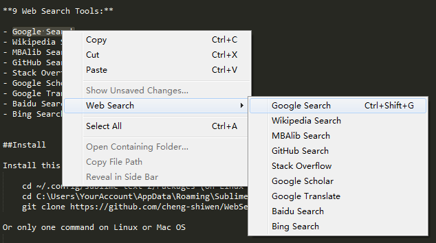

Web Search
=============

Search Google, Wikipedia, MBAlib, GitHub, Stack Overflow, Google Scholar, Google Translate, Baidu or Bing for the currently selected text in Sublime Text.

This package adds a "Web Search" item to the context menu in [Sublime Text][1].

**9 Web Search Tools:**

- Google Search
- Wikipedia Search
- MBAlib Search
- GitHub Search
- Stack Overflow
- Google Scholar
- Google Translate
- Baidu Search
- Bing Search

##Install

Install this repository

	cd ~/.config/sublime-text-2/Packages (On Linux or Mac OS)
	cd C:\Users\YourAccount\AppData\Roaming\Sublime Text 2\Packages (On Windows)
	git clone https://github.com/cheng-shiwen/WebSearch.git

Or only one command on Linux or Mac OS

	git clone https://github.com/cheng-shiwen/WebSearch.git ~/.config/sublime-text-2/Packages/WebSearch

Or you can select **Preferences** in the menu of Sublime Text and click **Browse Packages...** into your Sublime packages directory. Then download the package as a zip file [WebSearch-master.zip][2] and unzip it into your Sublime packages directory. Finally remember to rename the file folder into **WebSearch**.

##Usage

To use the command select some text and right click **Web Search** in the buffer area.

  [1]: http://www.sublimetext.com
  [2]: https://github.com/cheng-shiwen/WebSearch/archive/master.zip
